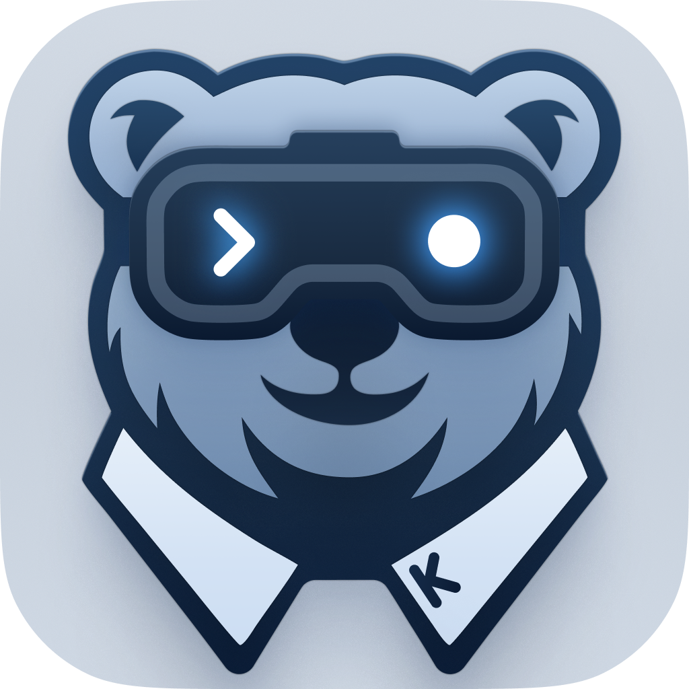

# OpenKaiden Artwork

## Icon

- [1024px](icon-1024.png)
- [2048px (1024@2x)](icon-1024@2x.png)

## Logo

- [SVG](logo.svg)
- [1093px](logo-1093.png)
- [2186px](logo-1093@2x.png)

## Avatar

- [avatar-circular-512.png](avatar-circular-512.png) – use when the circular avatar is needed (this is better cropped for rounded shapes)
- [avatar-square-512.png](avatar-square-512.png) – use when the square avatar is needed (standard crop)